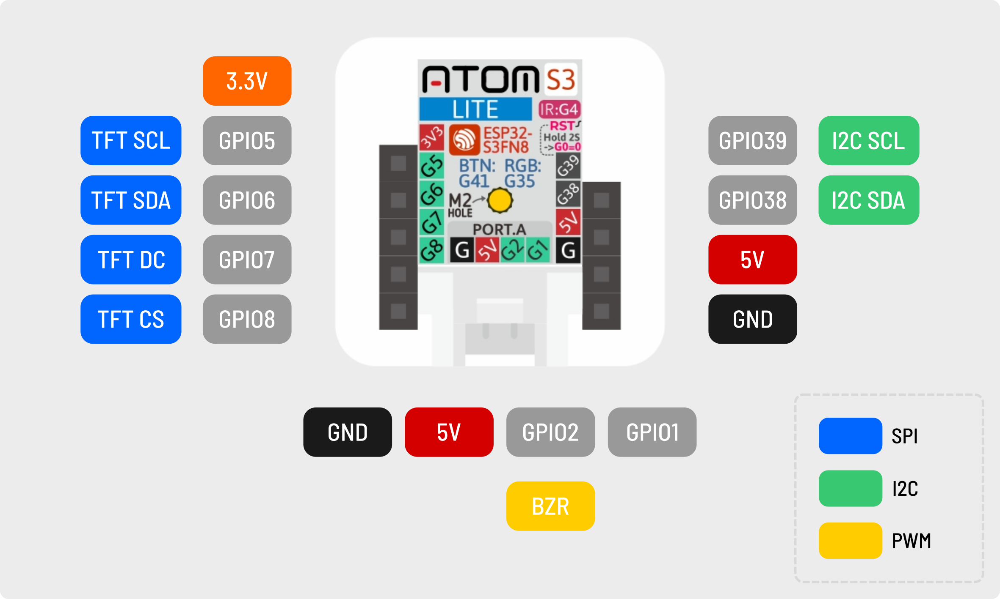
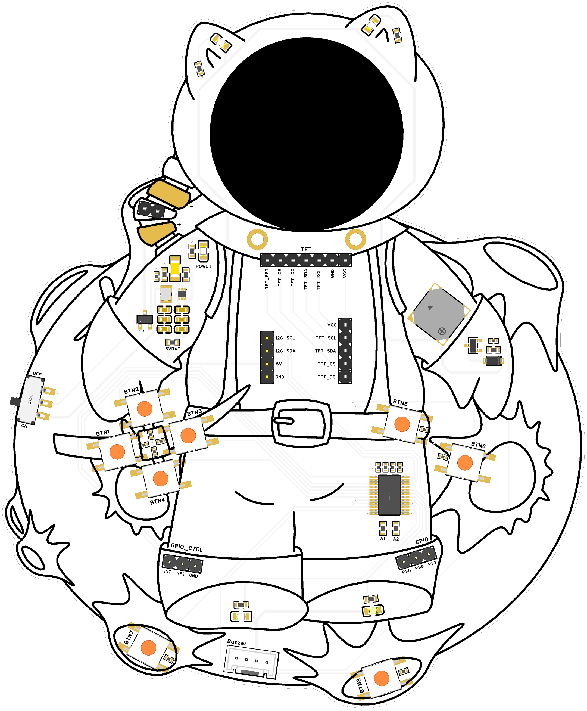

# LuxCamp Badge 2026

Badge for the LuxCamp 2026. It is a bring-your-own-microcontroller badge
with the following components:

  - [GC9A01](Datasheets/GC9A01A.pdf) 1.28 inch 240×240px TFT display
  - [UMW-TCA9539PWR](Datasheets/UMW-TCA9539PWR.pdf) I/O expander for reading buttons and controlling four LEDs  (TCA9535-compatible I2C protocol)
  - [XHXDZ SMD8530-32Ω](Datasheets/SMD8530-32Ohm.pdf) passive (externally driven) buzzer
  - [TPS61023](Datasheets/TPS61023.pdf)-based booster for battery powered operations

## Getting started

The examples in this repository have been written with the
[M5Stack Atom S3 Lite](https://shop.m5stack.com/products/atoms3-lite-esp32s3-dev-kit)
microcontroller in mind. Check out the following examples in the `Software`
folder to get familiarized with the badge:

 - [Getting Started with MicroPython](Software/MicroPython/)
 - [Getting Started with Arduino/PlatformIO](Software/CPP/)

### ⚠️ Errata and other important information

- **The `TFT_CS` and `TFT_DC` pins on the 5 pin header are mislabeled:** The labels printed on the PCB were mistakenly swapped (CS is DC and DC is CS). See the [schematic](Hardware/SCH_Schematic_2026-07-31.pdf) or the pinout below for the correct ordering. The `TFT_CS` and `TFT_DC` labels on the 7 pin header are correct.
- **To turn off the LEDs via I/O expander, configure the corresponding GPIO pins as input (floating)**: The I/O expander can only pull up to `VCC`, where as the LEDs are driven by `5V`. If your `VCC` is lower than 5V (such as for example with the Atom S3 Lite), they will not turn off completely when pulled high. Instead, configure the GPIO pin as input to _turn them off_, and configure the pin as output set to low to _turn them on_. The POWER LED cannot be turned off (but you may desolder it).
- **The maximum battery input voltage is 5.5V:** The `TPS61023` voltage booster supports 0.5 - 5.5V. If you use non-rechargeable AA or AAA batteries to power the board, never use more than three batteries (for a total of 4.5V).
- **Some boards were assembled with wrong LEDs**: Some boards have two blue LEDs on the astronaut's cat ears, rather than one blue and one red. This was an error by the manufacturer.

### Pinout for Atom S3 Lite

### Pinout of the I/O expander

| GPIO pin | Wire        | Recommended pin configuration                      |
|----------|-------------|----------------------------------------------------|
| `P0.0`   | BTN1        | Input                                              |
| `P0.1`   | BTN2        | Input                                              |
| `P0.2`   | BTN3        | Input                                              |
| `P0.3`   | BTN4        | Input                                              |
| `P0.4`   | BTN5        | Input                                              |
| `P0.5`   | BTN6        | Input                                              |
| `P0.6`   | BTN7        | Input                                              |
| `P0.7`   | BTN8        | Input                                              |
| `P1.0`   | TFT_RST     | Output (pull low to reset) / Input if unused       |
| `P1.1`   | LED_GREEN   | Output (pull low to turn on) / Input (to turn off) |
| `P1.2`   | LED_BLUE    | Output (pull low to turn on) / Input (to turn off) |
| `P1.3`   | LED_RED     | Output (pull low to turn on) / Input (to turn off) |
| `P1.4`   | LED_YELLOW  | Output (pull low to turn on) / Input (to turn off) |
| `P1.5`   | GPIO Header | None                                               |
| `P1.6`   | GPIO Header | None                                               |
| `P1.7`   | GPIO Header | None                                               |

## Render

## License

Unless stated otherwise, all files in this repository are licensed under
the [MIT License](LICENSE).
